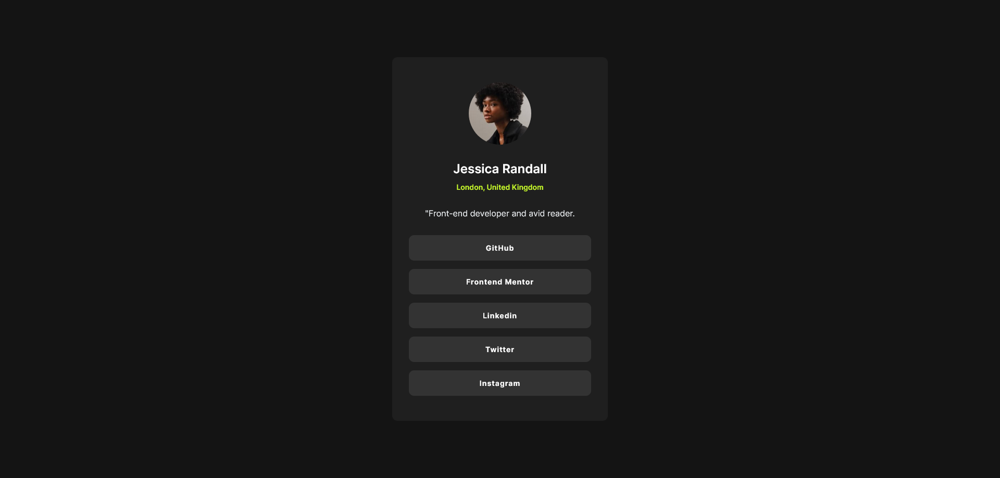

# Frontend Mentor - Social links profile solution

This is a solution to the [Social links profile challenge on Frontend Mentor](https://www.frontendmentor.io/challenges/social-links-profile-UG32l9m6dQ).

## Table of contents

- [Overview](#overview)
  - [Screenshot](#screenshot)
  - [Links](#links)
  - [Built with](#built-with)
- [Author](#author)

## Overview

### Screenshot

### Links

- [Solution URL](https://github.com/Kurt3z/socialLinksProfile)
- [Live Site URL](https://kurt3z.github.io/socialLinksProfile/)

### Built with

- Semantic HTML5 markup
- CSS3
- Flexbox

## Author

- Frontend Mentor - [@Kurt3z](https://www.frontendmentor.io/profile/Kurt3z)
- GitHub - [Kurt3z](https://github.com/Kurt3z)
